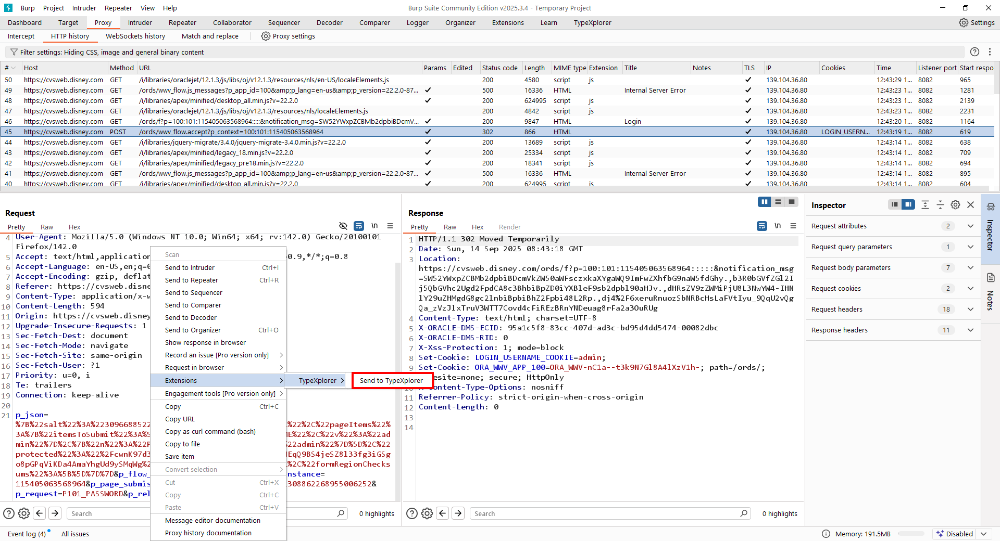
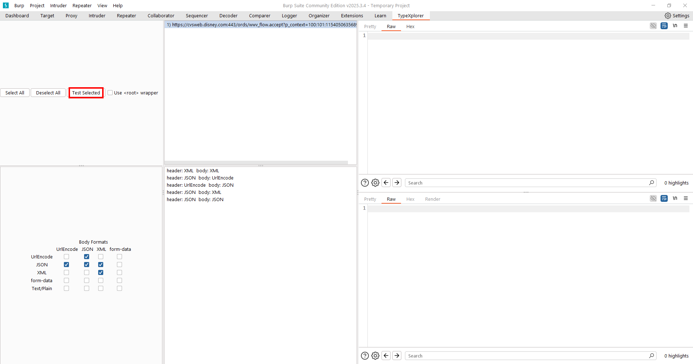

# TypeXplorer extension for Burp Suite

This is a Burp Suite extension designed to test different content types in HTTP requests. It allow users to test all possibilities of Content-Types (e.g., urlencoded, JSON, XML) and observe the responses in a user-friendly interface.
## Why use it ? 
- There are many times when we're trying to find CSRF, IDOR, ATO, and other types of vulnerabilities that involve certain restrictions. One common technique is changing the Content-Type header, but doing it manually isn't fun and can be exhausting. With this extension, all the checks happen with a single click
## Features

- Send HTTP requests with different content types.
- View request and response details in a split-pane interface.
- Delete entries using the delete key.
- Support for multiple test cases, including combinations of header and body formats.

## Installation

1. **Prerequisites**:
   - Burp Suite Professional or Community Edition.
   - Jython standalone JAR file (for running Python extensions in Burp Suite).
      - Installation guide [LINK](https://portswigger.net/burp/documentation/desktop/extend-burp/extensions/troubleshooting#you-need-to-configure-jython-or-jruby)

2. **Steps**:
   1. Download the extension code.
   2. Open Burp Suite and go to the "Extensions" tab.
   3. Click on "Add" in the "installed" section.
   4. Browse to the location of `TypeXplorer.py` and select it.
   5. Click "Next" and then "Close" to load the extension.

## Usage

**Sending Requests**:
   - Right-click on a request in Burp Suite (e.g., in the Proxy or Repeater tab).
   - Select "Send to TypeXplorer" from the context menu.
   - The request will be added to the extension's endpoint list.

**Deleting Entries**:
   - Select an endpoint in the list.
   - Press the delete key to remove it from the list.

https://github.com/user-attachments/assets/32230033-1e3a-416b-8ec0-99fb41c9e565

## Contributing

Contributions are welcome! Please follow these steps:

1. Fork the repository.
2. Create a new branch for your feature or bug fix.
3. Make your changes and commit them with descriptive messages.
4. Push your branch to your fork.
5. Open a pull request to the main repository.
